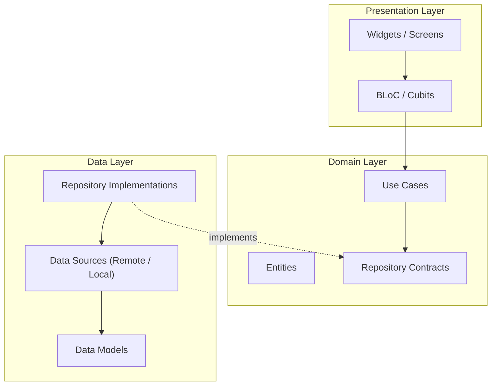
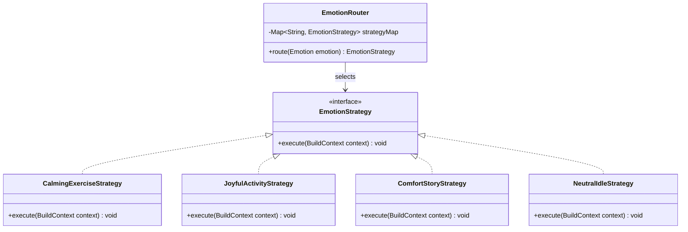

# Wanis -- Architecture

## 1. Technical Stack

| Layer / Concern      | Technology                          |
|----------------------|-------------------------------------|
| Framework            | Flutter (Dart)                      |
| State Management     | `flutter_bloc`                      |
| AI / ML              | TensorFlow Lite (`.tflite` model)   |
| Backend Auth         | Firebase Authentication             |
| Backend Database     | Cloud Firestore                     |
| Design Methodology   | Clean Architecture                  |
| Programming Paradigm | Object-Oriented Programming (OOP)   |

---

## 2. Clean Architecture

The codebase follows **Clean Architecture** principles with a strict three-layer separation. Dependencies point **inward** -- outer layers depend on inner layers, never the reverse.



### 2.1 Layer Responsibilities

#### Presentation Layer

- **Widgets / Screens**: Pure UI components that react to BLoC state changes. No business logic lives here.
- **BLoC / Cubits**: Receive events from the UI, invoke Domain use cases, and emit new states. All state management is handled through `flutter_bloc`.

#### Domain Layer

- **Entities**: Core business objects (e.g., `Emotion`, `ChildProfile`, `EmotionSession`). Framework-agnostic.
- **Use Cases**: Single-responsibility classes that encapsulate one business action (e.g., `DetectEmotion`, `GetEmotionReport`, `FetchCalmingContent`).
- **Repository Contracts**: Abstract interfaces defining data operations. The Domain layer never knows how data is fetched or stored.

#### Data Layer

- **Repository Implementations**: Concrete classes that fulfil Domain contracts by coordinating data sources.
- **Data Sources**: Remote (Firebase Auth, Firestore) and Local (TFLite model, cached content, local storage).
- **Data Models**: Serialisation / deserialisation objects (e.g., Firestore document mappings). Models map to and from Domain entities.

### 2.2 Directory Structure

> Items marked ✅ exist; items marked 📋 are planned.

```
lib/
├── firebase_options.dart          ✅  Generated Firebase config
├── main.dart                      ✅  App entry point (needs customisation)
├── models/                        ✅  OOP data models
│   ├── parent_user.dart           ✅
│   ├── child_profile.dart         ✅
│   └── content_item.dart          ✅
├── services/                      ✅  Firebase service wrappers
│   ├── auth_service.dart          ✅
│   └── firestore_service.dart     ✅
├── features/
│   ├── onboarding/                ✅  Login, Sign-up, Password reset flows
│   │   └── presentation/screens/  ✅  (9 screen files + shared widgets)
│   ├── auth/                      📋  Firebase auth (Clean Arch layers)
│   ├── emotion_detection/         📋  TFLite data source, inference pipeline
│   ├── child_interface/           📋  Content screens, emotion-routing strategies
│   └── parent_dashboard/          📋  Profile management, reports UI
└── core/                          📋  Shared utilities, constants, themes, routing
```

---

## 3. State Management -- flutter_bloc

Every feature follows a consistent BLoC pattern:

1. **Events** -- dispatched by the UI or by system triggers (e.g., a new emotion detected).
2. **BLoC** -- processes events, calls use cases, emits states.
3. **States** -- immutable objects representing the current condition of a feature (loading, loaded, error).

BLoCs never directly access data sources; they always go through Domain use cases.

---

## 4. Design Patterns

### 4.1 Strategy Pattern -- Emotion Router

The **Emotion Router** is a central component that receives a detected emotion and dynamically selects the correct response strategy. This avoids brittle, deeply nested `if/else` or `switch` chains.



#### How it works

1. The `EmotionRouter` holds a `Map<String, EmotionStrategy>` that maps each emotion class to a concrete strategy.
2. When a new emotion is detected, the BLoC passes it to the `EmotionRouter`.
3. The router looks up the matching strategy and returns it.
4. The Presentation layer calls `strategy.execute(context)` to trigger the appropriate UI/audio changes.

#### Emotion-to-Strategy Mapping

| Detected Emotion          | Strategy                   | Response                                      |
|---------------------------|----------------------------|-----------------------------------------------|
| Anger, Fear, Disgust      | `CalmingExerciseStrategy`  | Guided breathing, grounding techniques         |
| Sadness, Contempt         | `ComfortStoryStrategy`     | Interactive stories that validate feelings     |
| Happiness, Surprise       | `JoyfulActivityStrategy`   | Celebratory animations, upbeat music           |
| Neutral                   | `NeutralIdleStrategy`      | Gentle ambient state, exploration mode          |

### 4.2 Repository Pattern

Each feature defines an abstract repository in the Domain layer and a concrete implementation in the Data layer, keeping business logic decoupled from external services.

### 4.3 Dependency Injection

A service locator or DI container (e.g., `get_it`) will be used to wire up repository implementations, data sources, use cases, and BLoCs at app startup.

---

## 5. Rules and Conventions

1. **No business logic in Widgets.** Widgets observe BLoC states and dispatch events -- nothing more.
2. **No framework imports in Domain.** The Domain layer must remain free of Flutter / third-party dependencies.
3. **Single-responsibility Use Cases.** Each use case class has exactly one public `call()` method.
4. **Immutable States.** All BLoC states are immutable data classes.
5. **Strategy over conditionals.** Emotion-driven branching must go through the Emotion Router, not inline conditionals.
